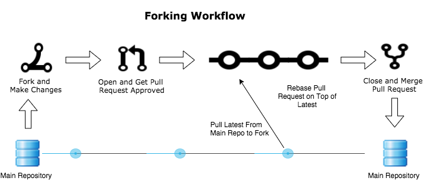
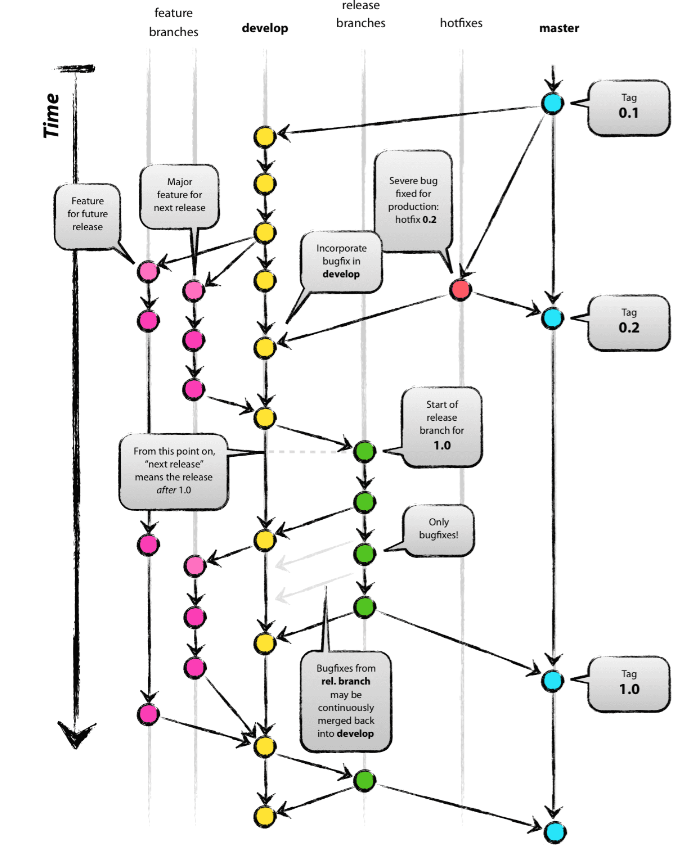

# Git_Workflows_Project
This is the final project for the course Version Control with Git

## Introduction

In this file we are summarizing 4 popular version control workflows: **Centralized, Feature Branch, Gitflow and Forking Workflows**. 

> **Version control** allows multiple people to collaborate on a project, track and manage changes, and revert to previous versions if necessary.

We will start from the most simple strategy and go in steps to more complex strategies. The discussed strategies could be utilized for different projects based on their complexity, structure, and the number of collaborators.

Each workflow has its own strengths and weaknesses, and understanding these can help teams select the most appropriate one for their needs. By adopting the right workflow, teams can improve their efficiency, reduce conflicts, and ensure a smoother development process.

---

### Centralized Workflow

The Centralized Workflow uses a central repository to serve as the single point of entry for all changes to the project. The default development branch is called main, and all changes are committed into this branch. This workflow doesn’t require any other branches besides main. 

The Centralized Workflow is like other workflows in its utilization of a remote server-side hosted repository that developers push and pull from. Compared to other workflows, the Centralized Workflow has no defined pull request or forking patterns. A Centralized Workflow is generally better suited for smaller size teams.

## Workflow from the perspective of a single developer

- Clone the master branch of remote repository
- Commit any changes to the local repository
- Push changes (a set of commits) to the central repository
- (If needed) resolve a conflict
- Push changes to central repository 

## Advantages and disadvantages of Centralized Workflow

The advantage of the Centralized Workflow is that there is only a small shift in how to think about your code and the repository. The team does not have to learn a completely new way and approach to using version control. The drawback to this workflow is that your master branch is always at risk of being broken by code changes. The other approaches we discuss address that.

---

### Feature Branch Workflow in Git

The core idea of the feature branch workflow is to avoid making direct updates to the main branch while creating features on independent branches.
This allow multiple developers to work on a feature without disrupting the main branch.
Due to this, the main branch will never contain broken code.

### The process for the developer
- Start in the latest main commit. (All feature branches must be created of the latest state of the project)
- Create a new branch and name it according to the feature being added.
- On the new branch, add, edit and commit changes.
- Once your feature is ready, push your commits to the central repository.
- Now your teammates can comment and approve the pushed commits.
- Finally create a merge pull request, making sure to resolve any issues and conflict before the final merge.

---

### Forking Workflow in Git

Forking workflow differs from other workflows that use a single "centralized" repository by having a server-side repository for every developer; those repositories are forked from the official repository.
This is most common with public open source projects.

---

*Source: https://docs.rhodecode.com/4.x/rce/collaboration/workflow-fork.html*

---

### The Benefits of Forking Workflow
- Contributers of the project may add, edit and commit changes without giving them write access to the official codebase.
- Only the project maintainer may push commits to the official repository.
- It provide a flexible way for large, organic teams to collaborate sercurely, that is including untrusted third parties.

---

## Gitflow Workflow

This version control method is a more modern approach to handling large projects in an efficient manner. It involves using different **feature branches** and  **multiple primary branches** which all have their specific roles. Compared to *Feature Branch Workflow* which uses one central branch (e.g. main) this branching strategy allows for more structured and robust way for introducing scheduled large updates and patches.  

***

*Source: Driessen, V., [A successful Git branching model](https://nvie.com/posts/a-successful-git-branching-model/)*

***

### Main branch

- This branch stores an **official release history**. 
- The commits to this branch are not frequent and tend to be tagged with their specific versions.
- New commits are either hotfixing bugs or introducing new major updates 
- **Goal** - allows having a stable version of a project

***

### Develop branch

- **Main contribution of this branching strategy**
- This branch serves as **an integration place for features**
- Feature branches are merged into this branch creating a preliminary version of an updated project
- **Goal** - serves a role of accumulating feautures and preparing projects before release

***

### Feature branches

- Work in similar manner as in *Feature Branch Workflow*
- Forked from develop branch and upon finishing are merged back into it
- **Goal** - playing ground for developers for safe experimenting with new feautures

***

### Release branch(es)
- This branch is used to **prepare a new version of a project for release**
- It is **forked from developed** and subsequently **merged into main**
- On this branch no new features are introduced and only bug fixes and similar things are added
- **Goal** - serves a role of a final preparation and refining of a new of version of a project

***

### Hotfix branches
- **Quickly patch production releases**
- It is **forked from main** and after a fix merged back into it
- **Goal** - serves a quick and simple way to hotfix a project

***

## Summary

We summarized here **4 popular version control workflows**. 

1. **Centralized Workflow** - A single central repository is used, and all changes are committed directly to it.

2. **Feature Branch Workflow** - Each new feature is developed in its own branch, which is merged back into the main branch once complete.

3. **Gitflow Workflow** - A more complex workflow that uses multiple branches for feature development, releases, and hotfixes to manage the project lifecycle.

4. **Forking Workflow** - Developers create their own fork of the repository, make changes, and then submit pull requests to the original repository for review and integration.

Each of these workflows can be tailored to fit different project requirements and team structures. By understanding the advantages of each workflow, teams can select the one that best aligns with their *development practices* and *project goals*, *ensuring efficient and organized collaboration*.
